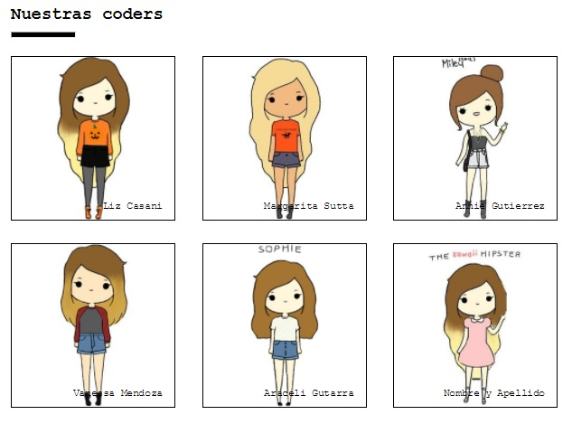

# Proyecto: "Nuestras Coders" #

En este ejercicio, apliqué lo aprendido en clase para poder recrear un cuadro con 6 compañeras de la promoción y sus respectivos nombres.

- Cambié las impagenes que aparecen en el LMS por cartoons de mis compañeras

¡Y mi resultado es el siguiente!

